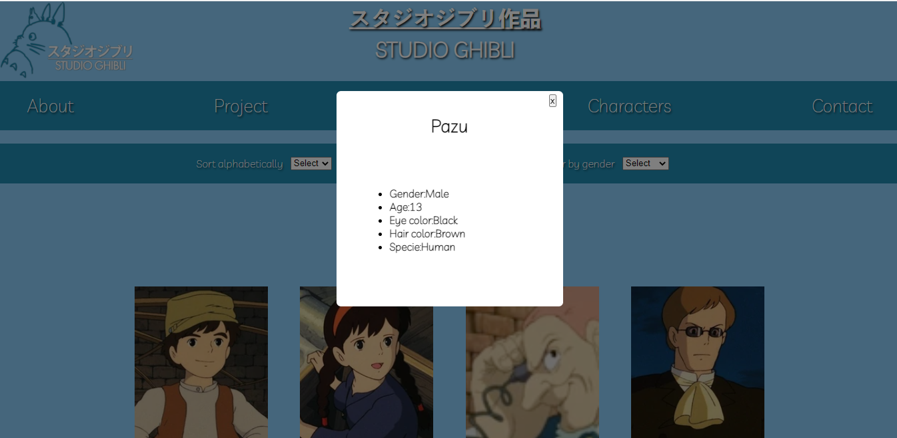

# Laboratória SAP006 - Segundo Projeto Data Lovers

## Índice

- [1. Sobre o projeto](#1-sobre-o-projeto)
- [2. Objetivo do projeto](#2-objetivo-do-projeto)
- [3. Para qual público destina-se esse produto](#3-para-qual-público-destina-se-esse-produto)
- [4. Necessidades do usuário](#5-necessidades-do-usuário)
- [5. Definição de interface](#6-definição-de-interface)
- [6. Como usar](#4-como-usar)
- [7. Considerações técnicas](#7-considerações-técnicas)
- [8. Contato](#8-contato)

---

## 1. Sobre o prejto

A nossa pagina web tem como tema o famoso **Studio Ghibli**, que é uma empresa japonesa, onde são criados vários filmes no estilo de animação. Todas as tramas contém fortes criticas sociais, que faz com que o espectador se questione sobre a moral do filme.

E para ajudar os fãs, criamos uma página com informações, onde eles poderão pesquisar sobre: sinopse, diretor, personagens e seus atributos, e até ter uma ideia do score (pontuação) de cada filme.

## 2. Objetivo do projeto

Essa página web foi criada com o objetivo de mostrar um conjunto de dados sobre a empresa cinematográfica **Studio Ghibli**, contendo nela diversos tipos de informações relacionadas tanto aos filmes, quanto aos personagens.

## 3. Para qual público destina-se esse produto

Esse produto destina-se principamente aos fãs dos filmes criados pelo **Studio Ghibli**, e também a todas as pessoas que tenham interesse ou curiosidade sobre os filmes, e queiram conhecer mais sobre o trabalho incrível dessa empresa. Pois conseguirão ter contato com várias informações.

## 4. Necessidades do usuário

Realizamos uma persquisa através de um forms e notamos que as necessidades do usuário eram as seguintes:

1º Usúario que gostaria de ter acesso a informções dos filmes e personagens: Para isso criamos cards com a foto do filme e dos personagens, que ao clicar aparecem as informações que ele deseja ver, tais como sinopse, direto, produtor, e data de lançamento, e para os peronagens informações como nome, idade, sexo, cor de cabelo e a cor dos olhos.

2º Usúario que gostaria de poder filtrar e ordenar os filmes e personagens: Notamos que muitos usuários tem a necessidade de poder ordenar os filmes e personagens, e para isso criamos diversos tipode de ordenação para que ele possa decidir como ver os filmes e personagens, tais como ordenar de A-Z, por data de lançamento, por diretor, e por uma barra de pesquisas, e para filtrar criamos um filtro por genero feminino, masculino e outros.

## 5. Interface

Nós iniciamos pela definição do layout através do protótipo de baixa fidelidade, onde decidimos o que era necessário ter me nossa apliação.

Começamos pela tela inicial:

Decidimos que queriamos fazer um menu para que o usúario pudesse navegar de uma simples e fácil, achando tudo que ele porcurasse apenas clicando no menu.

Depois para a tela onde apareceriam os cards:

Nessa tela decidimos que deveria aparecer um card por filme com o título, e por personagem e com o nome, para não ter muitas informações logo de cara para não ficar cansativo de ver.

Seguimos para o prototipo de alta fielidade, onde usamos o [Figma](https://www.figma.com/) (um site que ajuda a montar e ter uma ideia do layout do da sua aplicaçã).

Ao iniciar o layout percebemos que seria necessário alterar algumas coisas que haviamos pensado, pois visualmente ficaria melhor e mais confortavel na hora de utulizar nossa página.

E dessa forma nasceu o nosso site do **Studio Ghibli** com a pagina inicial.

Com nossas abas de menu contendo as seguintes abas:
- Sobre, que conta um pouco sobre o Studio Ghibli;
- Projeto, onde temos o nosso README;
- Filmes, que possui os cads com os posters de cada filme e suas informações;
- Personagens, que também possui os cards com a foto de cada personagem e suas informações;
- Conato, onde é possivel encontrar o nosso contato de Github, LinkedIn e email;

Em nossa aba de filmes temos todos os cartazes de filmes printados na tela  com as informações aparecendo por pop-up, e na de personagens temos todas as fotos de cada um dos personagens e o pop-up

E como puderam perceber algumas coias ficaram diferentes do protótipo de alta fidelidade, mas pensamos em fazer como implementações futuras.

## 6. Como usar

Para conseguir navegar em nossa página é muito simples, caso tenha alguma dúvida consulte aqui como usar:

<li>Escolha em nosso menu o que deseja ver primeiro e clique, ele te redicionará para a página com as informações;</li>
<li>Para ir para outra aba do site basta clicar nela;</li>
<li>E para voltar a tela inicial basta clicar no logo localizado no canto esquedo superior da tela;</li>
<li>Quando quiser saber mais sobre algum filme ou personagem basta clicar encima de seu cartaz ou foto, que as informações aparecerão em forma de pop-up;</li>
<li>Para fechar as informações basta clicar no "x" localizado no canto superior direito, ou fora do pop-up que ele irá fechar</li>
<li>E para ver as informações de outro filme ou personegem basta clicar em outro cartaz ou foto, após fechar o pop-up</li>
 

## 7. Objetivos de aprendizagem

O objetivo principal deste projeto é que aprenda a desenhar e construir uma interface web onde se possa visualizar e manipular dados, entendendo o que o usuário necessita.

Em outras palavras, você aprenderá a:

### HTML e CSS

- [Uso de HTML semântico.](https://developer.mozilla.org/en-US/docs/Glossary/Semantics#Semantics_in_HTML)
- Uso de seletores de CSS.
- Construir sua aplicação respeitando o desenho realizado (protótipo).
- [Uso de flexbox em CSS.](https://css-tricks.com/snippets/css/a-guide-to-flexbox/)

### DOM e Web APIs

- Uso de seletores de DOM.
- Gerenciamento de eventos de DOM.
- [Manipulação dinâmica de DOM.](https://developer.mozilla.org/pt-BR/docs/DOM/Referencia_do_DOM/Introdu%C3%A7%C3%A3o) (appendChild |createElement | createTextNode| innerHTML | textContent | etc.)

### JavaScript

- Uso de condicionais (if-else | switch | operador ternário)
- Uso de laços (for | for..in | for..of | while)
- Uso de funçõ

## 8. Contato

### Jéssica
- Github:https://github.com/jehkaori
- LinkedIn:https://www.linkedin.com/in/j%C3%A9ssica-inamassu-2858b61b9/
- Email: inamassu.kaori@gmail.com

### Michele
- Github: https://github.com/mivalerio
- LinkedIn: https://www.linkedin.com/in/michele-martins-b5483229/
- Email: michele.valerio@outlook.com.br

